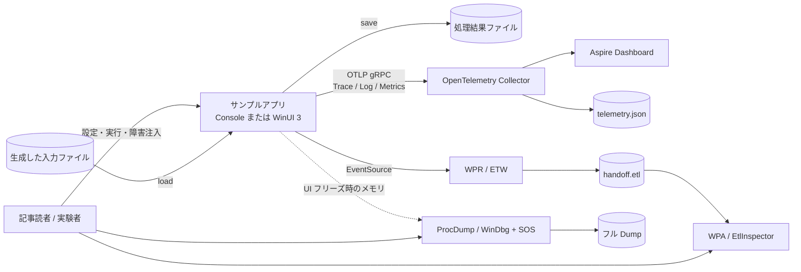
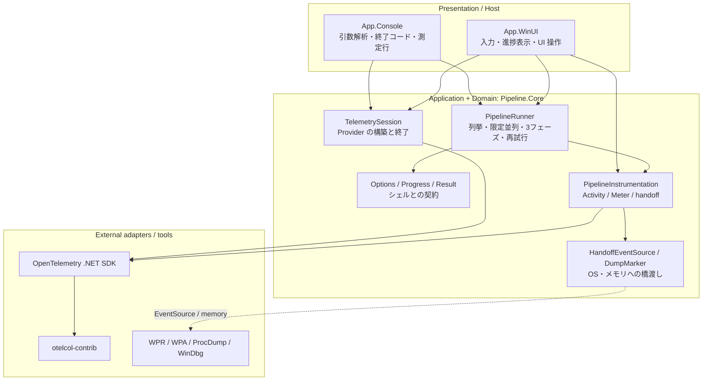
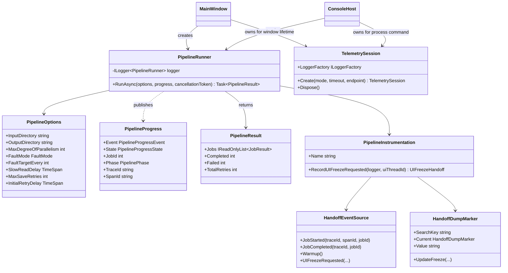
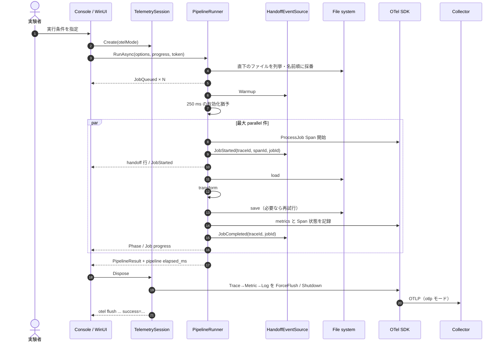
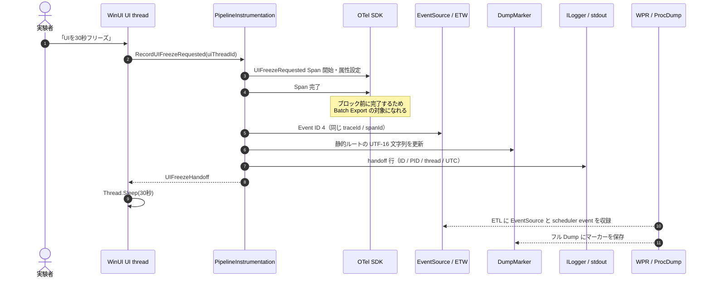
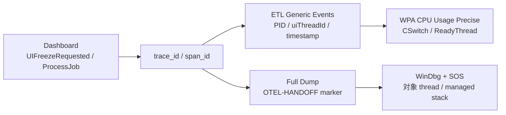
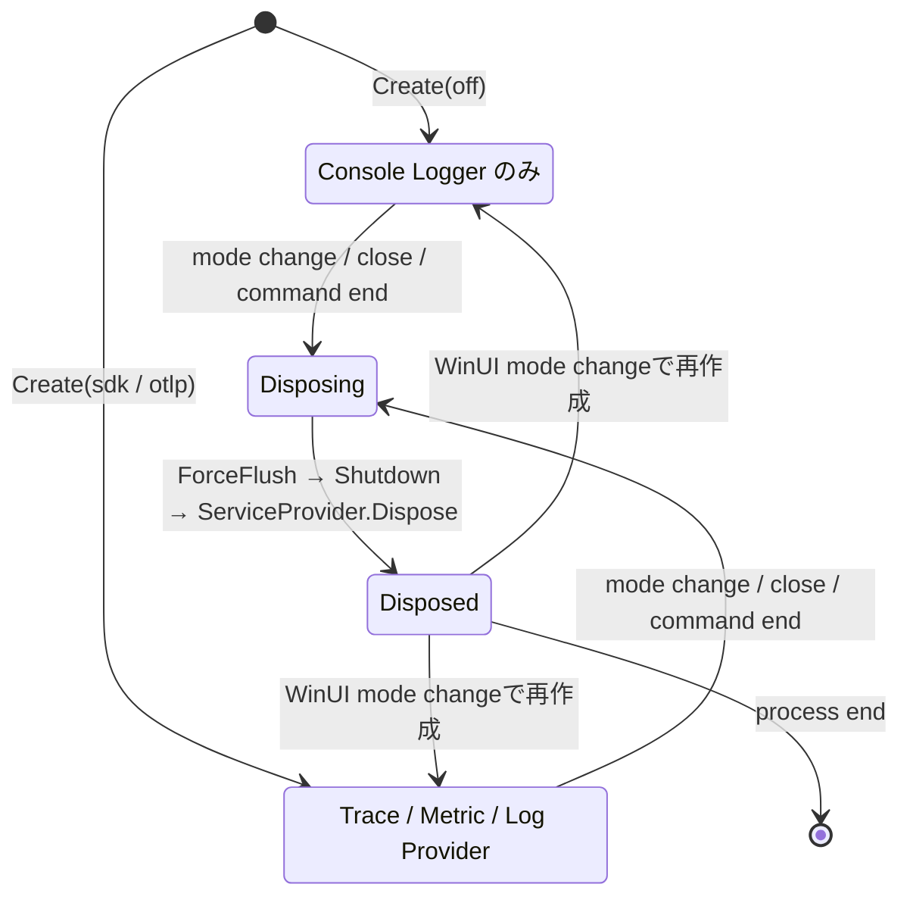
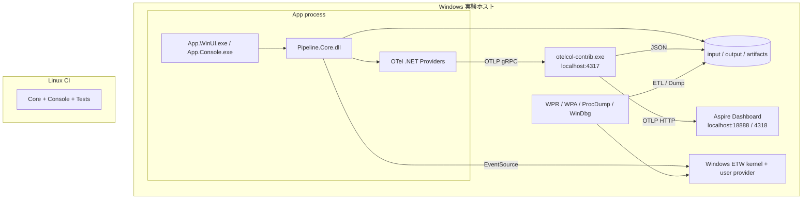
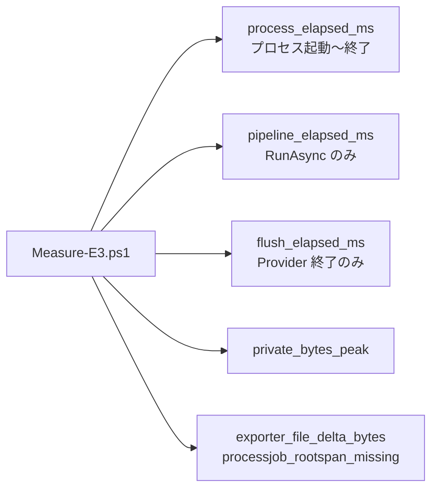
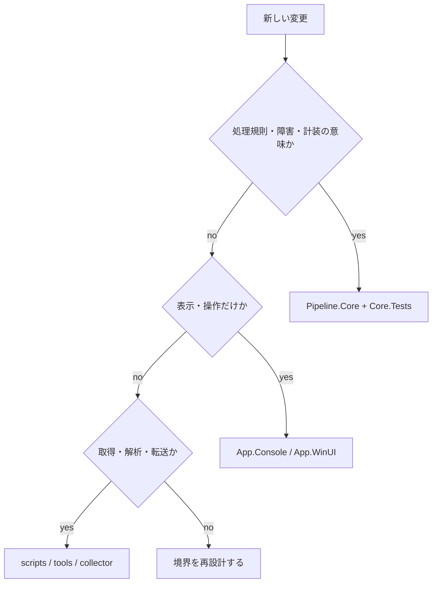

# アーキテクチャ設計書

## 1. 文書情報

| 項目 | 内容 |
|---|---|
| 対象 | `otel-windows-handoff` サンプルアプリと観測・測定ツール群 |
| ステータス | 実装準拠（as-built） |
| 読者 | 記事読者、サンプルを拡張する開発者、計装・障害解析のレビュー担当者 |
| 基準 | Issue #68 対応後の構成 |
| 最終更新 | 2026-07-20 |

本書は、Zenn 記事「Windows デスクトップアプリの障害解析に OpenTelemetry はどこまで使えるか」のサンプル実装について、構造、実行時挙動、観測データの契約、測定境界、設計判断を一つのモデルとして記述する。README は再現手順、本書は「なぜこの境界と責務にしたか」を扱う。

## 2. 設計の要約

本システムの中心命題は、OpenTelemetry だけでは説明し切れない Windows デスクトップアプリの障害を、同一の相関 ID によってアプリケーション層から OS・プロセス層へ段階的に掘り下げられるようにすることである。

```text
Trace / Log / Metrics ── trace_id ──> ETW ── PID・時刻・Thread ID ──> Dump / Wait 解析
       何が遅いか                    どこで待ったか                 なぜ停止したか
```

この目的に対し、次の原則を採用する。

1. **一つの業務実装**: 障害注入、再試行、計装は `Pipeline.Core` に集約し、Console と WinUI は同じ実装を呼ぶ。
2. **決定的な障害**: ファイル名順の `job.id` で対象を決め、並列スケジュールに結果を依存させない。
3. **相関情報を先に確定**: UI をブロックする前に Span を完了し、同じ ID を ETW、Dump、ログへ複製する。
4. **所有権を明示**: OTel Provider 群は `TelemetrySession` がまとめて所有し、アプリ寿命の境界で flush / shutdown する。
5. **測定とデモを分離**: 通常デモ用 Collector と E3 測定用 Collector を分け、測定対象外の Windows Performance Counter を混入させない。
6. **プラットフォーム境界を守る**: Core、Console、Tests は Windows 専用 API に依存させず、Linux CI をアーキテクチャ適合性テストとして使う。

## 3. スコープと設計ドライバー

### 3.1 スコープ

本書の対象は次のとおり。

- ファイルを `load` → `transform` → `save` するサンプルパイプライン
- Console / WinUI 3 の二つの実行ヘッド
- OpenTelemetry Trace / Log / Metrics の生成、OTLP 送信、終了処理
- EventSource、WPR / WPA、ETL 検査、フル Dump を使う E2 の引き継ぎ
- `off` / `sdk` / `otlp_up` / `otlp_down` を比較する E3 の測定
- Windows と Linux のビルド・テスト境界

対象外は、認証付きの遠隔 Collector、本番運用の可用性設計、永続ジョブキュー、入力ファイルの業務的な妥当性検証、クラッシュダンプの自動収集基盤である。

### 3.2 品質特性シナリオ

| 優先度 | 品質特性 | 刺激と期待応答 | 採用した戦術 |
|---:|---|---|---|
| 1 | 再現性 | 同じ入力と設定で再実行すると、同じ `job.id` が遅延・失敗する | 名前順採番、剰余による障害対象決定、固定遅延、固定リトライ |
| 2 | 診断可能性 | UI フリーズ発生後、Trace から ETW と Dump の対象を一意に絞れる | `trace_id` / `span_id` / PID / Thread ID / UTC 時刻の多重記録 |
| 3 | 理解容易性 | 読者が UI 実装を読まずに処理と計装の全体像を追える | 薄いシェル、Core への集約、計装名の集中管理、明示的な進捗 DTO |
| 4 | 移植性 | Linux CI で業務ロジックとテストを実行できる | Core では `EventSource` までを使用し、WPR / WinUI を境界外に隔離 |
| 5 | 測定妥当性 | OTel モード別の差に別受信機や起動順の偏りを混ぜない | E3 専用 Collector、ウォームアップ除外、条件インターリーブ、列の分離 |
| 6 | 終了時完全性 | 正常終了時にバッファ済みテレメトリを可能な範囲で送出する | Provider の所有権集約、共通タイムバジェットで ForceFlush → Shutdown |
| 7 | 情報最小化 | 公開サンプルや Span に環境固有の絶対パスを残さない | `file.name` はベース名のみ、生成物をコミットしない |

## 4. システムコンテキスト



システムの信頼境界はローカルマシン内に閉じる。既定の OTLP エンドポイントは `localhost:4317` であり、Collector はローカル Dashboard とファイルへ転送する。本構成を外部ネットワークへ公開する場合は、認証、TLS、データ分類、保持期間を別途設計しなければならない。

## 5. 論理アーキテクチャ

### 5.1 レイヤーと依存方向



矢印はコンパイル時または実行時の利用方向を表す。重要な制約は次のとおり。

- `Pipeline.Core` は `App.Console`、`App.WinUI`、WinUI API、WPR API を参照しない。
- Console と WinUI は互いを参照しない。表示都合のロジックを共有したい場合も、業務規則でなければ各シェル内に留める。
- 障害対象決定、リトライ、Span / Metric / EventSource 発行をシェルへ複製しない。
- WPR、WPA、ProcDump はプロセス外の診断アダプターであり、通常実行の必須依存にしない。
- Collector の停止や可用性がパイプラインの成否を変えない。OTLP は観測経路であり業務データ経路ではない。

### 5.2 コンポーネント責務

| コンポーネント | 責務 | 所有しない責務 |
|---|---|---|
| `PipelineRunner` | ファイル列挙、安定した採番、限定並列、フェーズ実行、障害注入、再試行、進捗・結果生成 | UI 状態、CLI 引数、Exporter 設定 |
| `PipelineOptions` | 実行条件とテスト用の時間・回数パラメーター | 環境変数や UI コントロールへのアクセス |
| `PipelineProgress` / `PipelineResult` | シェルへ返す不変スナップショットと最終結果 | 表示文字列、色、レイアウト |
| `PipelineInstrumentation` | 計装名と Instrument の一元管理、UI フリーズの相関情報生成 | Provider の寿命、UI のブロックそのもの |
| `HandoffEventSource` | .NET 標準の EventSource 契約で ETW へ橋渡し | WPR セッションの開始・停止 |
| `HandoffDumpMarker` | 最後のフリーズ相関情報を静的 GC ルートから到達可能にする | Dump 取得、Dump の保存先管理 |
| `TelemetrySession` | LoggerFactory、Tracer / Meter / Logger Provider の所有と終了順序 | パイプライン実行、Collector のプロセス管理 |
| `App.Console` | 引数、コマンド、標準出力契約、終了コード | パイプライン規則 |
| `App.WinUI` | 入力、実行制御、進捗のバッチ反映、選択ジョブ詳細、フリーズ操作 | 障害注入や再試行の実装 |
| `collector/*` | OTLP 受信、バッチ処理、可視化・ファイル出力 | 相関 ID の生成、アプリ制御 |
| `scripts/*` | 再現可能な E2 取得と E3 測定のオーケストレーション | アプリ内部の計測値算出 |

### 5.3 主要型の静的構造



`PipelineRunner` は状態を実行間で保持しない。したがって、実行ごとの可変状態は `RunAsync` のローカルスコープに閉じ、シェルから runner を再生成しても意味が変わらない。対して `TelemetrySession` と `HandoffDumpMarker.Current` は明示的に長寿命であり、寿命の違いを型の責務として分離している。

## 6. 実行時アーキテクチャ

### 6.1 通常のジョブ実行



処理上の不変条件は次のとおり。

- 入力は直下のファイルだけを対象とし、ファイル名を ordinal 順で並べ、1 始まりで採番する。
- 障害対象は `job.id % FaultTargetEvery == 0` で決まり、開始順・完了順には依存しない。
- 各ジョブは `load`、`transform`、`save` の順序を変えない。ジョブ間だけを限定並列にする。
- `access-denied` は実 ACL を変更せず例外を模擬し、初回失敗後に最大3回、100 / 200 / 400 ms の指数バックオフで再試行する。
- 進捗は並列に通知され得るが、最終 `PipelineResult.Jobs` は `job.id` 順へ戻す。
- `file.name` と進捗の `FileName` にはパスを含めない。

### 6.2 UI フリーズと E2 引き継ぎ



ここでは「フリーズ中の Span」を作らない。UI スレッドが停止すると Span の終了処理自体が走れず、エクスポート前の未完了 Span になるためである。代わりに、**フリーズを要求した事実を表す短い完了済み Span** を作り、ブロック前の因果境界を確定する。

相関の探索順は次を標準とする。



`trace_id` は観測面をまたぐ主キー、`span_id` は同一フリーズ操作の識別子、PID・Thread ID・UTC 時刻は ETL と Dump の候補を限定する補助キーである。一つのキーだけに依存せず、複数の一致をもって同一事象と判断する。

### 6.3 TelemetrySession の状態と所有権



- Console は1コマンドにつき1セッションを `using` で所有する。
- WinUI はウィンドウ寿命で1セッションを所有する。パイプライン単位で作り直さないため、実行外の UI フリーズも計装できる。
- WinUI でモードを変更すると、古いセッションを完全に Dispose してから新しいセッションを作る。同じ `ActivitySource` に複数 Provider を重ねない。
- 終了時の全 Provider は単一の `shutdownTimeout` を共有する。各 Provider にタイムアウト全量を与えて総時間を膨張させない。
- `Dispose` は冪等である。終了成否は `otel flush` 行として測定可能にする。

### 6.4 スレッドと並行性

| 実行主体 | 主な責務 | 共有状態の扱い |
|---|---|---|
| WinUI UI thread | 入力、コマンド、進捗 ViewModel 反映、意図的フリーズ | `ProgressBuffer` がワーカ通知をまとめて DispatcherQueue へ戻す |
| Pipeline workers | ジョブ単位の load / transform / save | `Parallel.ForEachAsync` で並列度を上限化。結果は `ConcurrentBag`、集計は `Interlocked` |
| OTel SDK workers | Batch Export と送信 | SDK が所有。アプリは終了境界で flush / shutdown を要求 |
| WPR / Collector / ProcDump | プロセス外の記録・転送 | アプリ状態を変更せず、失敗しても業務結果に影響させない |

Freeze ボタンはパイプライン実行中も操作可能である。これは複数ジョブの Trace が存在する状況で、フリーズ操作固有の root Span を識別するための意図的な設計である。UI の設定変更は実行中に無効化するが、診断操作まで無効化しない。

## 7. 観測データの契約

### 7.1 OpenTelemetry

共通の `service.name` は `otel-windows-handoff`、ActivitySource / Meter 名は `OtelWindowsHandoff.Pipeline` である。

| 種別 | 名前 | 主要属性・意味 |
|---|---|---|
| Root Span | `ProcessJob` | `job.id`, `file.name`, `file.size_bytes`, `retry.count` |
| Child Span | `load` | 読み込みと `slow-read` の所要時間 |
| Child Span | `transform` | CPU 処理を模した変換時間 |
| Child Span | `save` | 保存、再試行、最終例外 |
| Root Span | `UIFreezeRequested` | `operation.name=ui-freeze`, `ui.thread.id`, `process.id` |
| Counter | `jobs.completed` | 成功ジョブ数 |
| Counter | `jobs.failed` | 失敗ジョブ数 |
| Counter | `retries.total` | 保存再試行回数 |
| Histogram | `job.duration` | ジョブ所要時間、単位 ms |
| Log | フェーズ・再試行・失敗・handoff | `Activity.Current` がある箇所では SDK が Trace と相関 |

`off` モードでも EventSource、通常の Console Logger、handoff 行は残る。ただし Provider のリスナーがないため Activity は no-op になり、アプリが生成したランダム ID は ETW / ログ内の相関にだけ使われる。`sdk` は Provider を構築するが Exporter を持たず、`otlp` だけが OTLP gRPC Exporter を登録する。

### 7.2 EventSource

Provider 名は `OtelWindowsHandoff-Handoff` とし、イベント ID とペイロード順を公開契約として固定する。

| ID | イベント | ペイロード |
|---:|---|---|
| 1 | `JobStarted` | `traceId`, `spanId`, `jobId` |
| 2 | `JobCompleted` | `traceId`, `jobId` |
| 3 | `Warmup` | なし |
| 4 | `UIFreezeRequested` | `traceId`, `spanId`, `processId`, `uiThreadId`, `operationName` |

EventSource の有効化通知は非同期である。先頭の意味あるイベントを失う危険を減らすため、ジョブより前に破棄可能な `Warmup` と既定250 msの猶予を置く。WPR はアプリより先に開始する。常時5秒待つ設計は E3 のパイプライン時間を支配するため採用しない。

### 7.3 テキストと Dump の契約

```text
handoff ts=<UTC ISO 8601> pid=<PID> trace_id=<32hex> job=<job.id>
handoff ts=<UTC ISO 8601> pid=<PID> trace_id=<32hex> span_id=<16hex> ui_thread=<id> operation=ui-freeze
OTEL-HANDOFF freeze trace_id=<32hex> span_id=<16hex> pid=<PID> ui_thread=<id> ts=<UTC ISO 8601>
pipeline elapsed_ms=<integer>
otel flush mode=<off|sdk|otlp> elapsed_ms=<integer> success=<true|false>
```

これらは README、補助スクリプト、ETL 検査、テストが参照する機械可読契約である。見た目を整える目的でキー名や空白を変更してはならない。変更時は利用箇所と記事を同時に更新する。

## 8. 配置アーキテクチャ



Windows の全体 Solution は WinUI を含めてビルドする。Linux の solution filter は Core、Console、Tests だけを含み、Windows 専用機能を除外する。この非対称は欠落ではなく、プラットフォーム境界をコードベースで検証するための意図的な配置設計である。

## 9. E3 測定アーキテクチャ

### 9.1 測定境界



`process_elapsed_ms`、`pipeline_elapsed_ms`、`flush_elapsed_ms` は包含関係を持つが、同じ値ではない。特に pipeline の計測区間へ SDK 初期化と終了 flush を混ぜず、利用者が知りたい「処理中のオーバーヘッド」と「終了時コスト」を分離する。

### 9.2 条件と妥当性の統制

| 条件 | Provider | Exporter | Collector | 狙い |
|---|---|---|---|---|
| `off` | なし | なし | 不問 | API 呼び出しを残した SDK 無効の基準 |
| `sdk` | あり | なし | 不問 | Span / Metric / Log 生成・処理コスト |
| `otlp_up` | あり | OTLP | 稼働 | 正常送信を含むコストと欠落確認 |
| `otlp_down` | あり | OTLP | 停止 | 到達不能時の終了時間と欠落の上限確認 |

測定手順は各条件のウォームアップを `run_index=0` として記録し、集計から除外できるようにする。`off` / `sdk` / `otlp_up` は実行順をローテーションし、温度・キャッシュ・時間経過に伴う偏りを一条件へ集中させない。Collector を停止する `otlp_down` は破壊的な条件なので最後に固定する。

E3 専用の `collector/otelcol-e3.yaml` は `windowsperfcountersreceiver` を含まない。通常デモのホストメトリクス収集負荷を、アプリの OTel モード比較へ混入させないためである。OS ファイルキャッシュ、ウイルス対策、他プロセス負荷は統制していないため、結果は絶対性能ではなく同一環境内の条件差として解釈する。

`processjob_rootspan_missing` は Collector の file exporter で観測できなかった `ProcessJob` 数であり、アプリ内で Span が生成されなかったことを直接証明する値ではない。`otlp_down` では受信側の観測点自体がないため全件 missing と扱う。アプリ内生成と送信中の損失を分離する実験へ拡張する場合は、同一 run に in-memory exporter など独立した観測点を追加する必要がある。

## 10. 主要な設計判断とトレードオフ

| 判断 | 採用理由 | 代償 / 注意点 |
|---|---|---|
| Core に業務処理と計装を集約 | 二つのヘッドと Linux テストで同じ挙動を保証 | Core が OTel パッケージを参照するため、純粋ドメイン層ではない |
| EventSource を Core に置く | OS 固有 API を直呼びせず Windows ETW と Linux build を両立 | ETW 以外の OS ではイベントを診断用途に活かさない |
| 障害対象を `job.id` で決定 | 並列実行でも同じ対象を再現 | 入力ファイル集合や名前が変われば採番も変わる |
| 実 ACL ではなく例外を注入 | 権限差や cleanup 失敗を排除し、Linux でも検証 | 実 ACL 起因の OS スタックそのものは再現しない |
| フリーズ前に独立 root Span を完了 | UI 停止中でも export 可能で、操作を一意に識別 | 実際の30秒は Span duration に含まれず、ETW / Dump で補完が必要 |
| Dump marker を静的ルートで保持 | GC 後も SOS と UTF-16 検索で到達しやすい | 保持できるのは最後のフリーズ操作だけ |
| TelemetrySession をアプリ寿命で所有 | UI 操作も計装し、終了順を一元化 | モード変更時に同期的な flush 時間が発生する |
| WPR で kernel と user event を同時収録 | 同一タイムラインで Wait と相関できる | ETL が大きくなり、管理者権限と WPT が必要 |
| 通常 / E3 Collector 設定を分離 | デモ機能と測定純度を両立 | 設定差を理解せず取り違えない手順が必要 |
| 進捗をイベントスナップショットで公開 | UI が Core 内部へ問い合わせず、並列状態を表示できる | 高頻度通知を UI 側でバッチ化する必要がある |

### 10.1 採用しなかった案

- **WinUI にパイプラインを直接実装**: Console とテストの挙動が分岐し、記事の再現条件が崩れるため不採用。
- **フリーズ中ずっと開いた Span**: UI スレッドが戻らない事象では未完了のまま失われるため不採用。
- **ジョブ Span のどれかをフリーズ操作へ流用**: パイプライン外でも起こせる UI 操作と因果が一致せず、複数ジョブ実行中に曖昧になるため不採用。
- **実行順で10件ごとに障害注入**: スケジューラにより対象が変わるため不採用。
- **Collector 停止を自動で復旧して測定継続**: `otlp_down` の後に条件を戻すと環境状態が複雑になるため、停止条件を最後に固定。
- **WPR 接続待ちを常に長く取る**: ETW の先頭欠落は減るが E3 の値を歪めるため、短い Warmup と開始順の手順で対処。

## 11. セキュリティ、プライバシー、生成物

- Span の `file.name`、進捗、ログへ入力・出力の絶対パスを載せない。
- API キー、実在組織名、個人名、マシン固有の固定値をソース・設定・説明へ埋め込まない。
- `host.name` は SDK Resource の実行時属性であり、公開リポジトリへ固定値として保存しない。外部送信する構成へ変更する場合は削除または匿名化を検討する。
- ETL と Dump はプロセス情報やメモリ内容を含み得る機微な診断データである。`artifacts/` や `results/` の生成物はコミットせず、共有前に内容と保持期間を確認する。
- 既定の Collector はローカル実験用で、認証境界ではない。ポートを外部公開しない。

## 12. 変更ガイドとアーキテクチャ適合性

### 12.1 機能追加の配置判断



新しいフェーズ、障害モード、観測属性を追加する場合は、最低でも次を同じ変更単位で扱う。

1. Core の実装と XML コメント
2. 決定性・Span 階層・エラー状態を検証する Core.Tests
3. Console / WinUI の設定入力と表示（必要な場合）
4. README の再現コマンドと期待結果
5. 本書の契約表・シーケンス・設計判断
6. 記事で使う名称とスクリーンショットの整合性

### 12.2 Fitness Functions

| 守る性質 | 自動・手動の検査 |
|---|---|
| Core のプラットフォーム中立性 | Linux CI で `OtelWindowsHandoff.Linux.slnf` を build / test |
| WinUI を含む統合整合性 | Windows CI で `OtelWindowsHandoff.sln` を Release build |
| 決定的な障害対象 | `PipelineRunnerTests` で対象 job ID と結果を検証 |
| Span 構造と属性 | ActivityListener を使う単体テスト |
| UI フリーズの同一 ID・完了順 | Span、EventSource、Dump marker、handoff 行の統合単体テスト |
| EventSource ペイロード | EventListener と `EtlInspector`、実機では WPR / WPA |
| E3 の機械可読出力 | `Measure-E3.ps1` の列、ログ抽出、Exporter 差分 |
| 公開物の衛生 | diff review。絶対パス、機密値、バイナリ生成物を含めない |

標準検証コマンドは次のとおり。

```powershell
dotnet build .\OtelWindowsHandoff.sln --configuration Release
dotnet test .\OtelWindowsHandoff.sln --configuration Release --no-build
dotnet build .\OtelWindowsHandoff.Linux.slnf --configuration Release
dotnet test .\OtelWindowsHandoff.Linux.slnf --configuration Release --no-build
dotnet build .\tools\EtlInspector\EtlInspector.csproj --configuration Release
wpr -profiles .\collector\handoff.wprp
```

## 13. 既知の制約と運用上の責任分界

- CI はコンパイル、単体テスト、依存境界を保証するが、WinUI の起動、操作、OTLP 到達、WPR / Dump の実取得までは保証しない。Windows 実機での受け入れ確認が必要である。
- UI フリーズは診断経路を説明する教育用の `Thread.Sleep` であり、実際の deadlock、COM 待機、I/O 待機を再現するものではない。
- Dump marker は最新値一件だけを保持する。複数フリーズ履歴が必要なら、上限付きリングバッファと Dump サイズ・個人情報の影響を再設計する。
- OTLP 到達不能でもパイプラインは成功し得る。送信成否は `otel flush ... success=` と E3 の欠落列で判断する。
- EventSource と kernel event の時刻相関は同一ホスト・同一記録セッションを前提とする。別ホスト間の時刻同期問題は対象外である。
- Collector の file exporter は実験の到達確認用であり、耐久キューや監査ログではない。

## 14. 要求トレーサビリティ

| 記事・Issue の論点 | 実装上の責任点 | 証跡 |
|---|---|---|
| E2: Trace から ETW へ移れる | `ProcessJob` / `UIFreezeRequested` と EventSource の共有 ID | Dashboard、handoff 行、ETL |
| E2: ETW からフリーズ原因へ移れる | Event ID 4 の PID / UI Thread ID、kernel scheduler events | WPA CPU Usage (Precise)、EtlInspector |
| E2: Dump から trace ID を回収できる | `HandoffDumpMarker.Current` の固定キーと UTF-16 文字列 | WinDbg + SOS、文字列検索 |
| E3: OTel のコストを条件別に比較できる | `OtelMode`、TelemetrySession、E3 専用 Collector | `e3-results.csv` |
| E3: 処理時間と終了処理を分離できる | `pipeline elapsed_ms` と `otel flush` 行 | 各 run の stdout と CSV |
| サンプルの再現性 | 安定採番、決定的障害、生成コマンド | Core.Tests、README コマンド |
| Console / WinUI の整合性 | 共通 `PipelineRunner` / `PipelineOptions` | Linux / Windows CI |

## 15. 用語

| 用語 | 本書での意味 |
|---|---|
| E2 | OpenTelemetry の相関 ID を ETW と Dump へ引き継ぎ、障害解析を深掘りする実験 |
| E3 | OTel の無効・SDKのみ・送信成功・送信不能を比較する測定 |
| handoff | 一つの観測手段から次の観測手段へ移るための相関情報 |
| root Span | 親を持たず、ジョブまたは UI 操作を独立して表す Span |
| EventSource | .NET 標準のイベント発行 API。Windows では ETW Provider として収録できる |
| ETL | WPR が保存する ETW トレースファイル |
| Fitness Function | アーキテクチャ制約が保たれているか継続的に判定する検査 |
